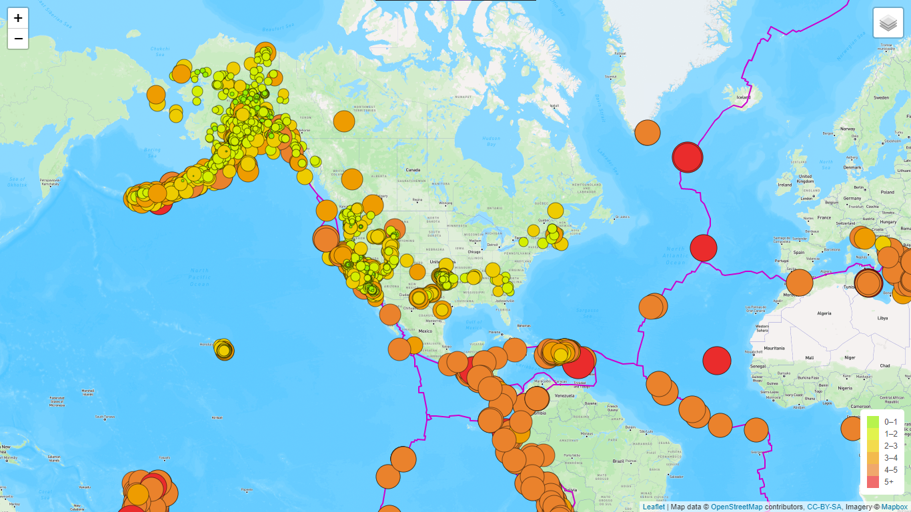
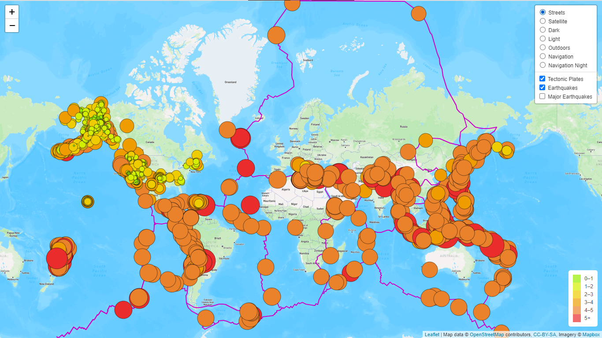
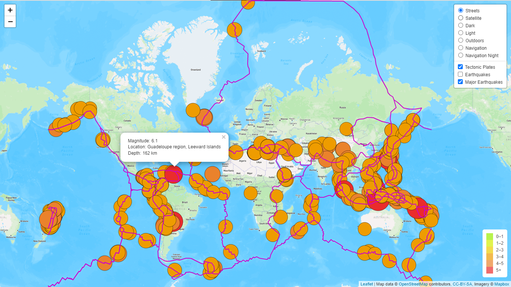
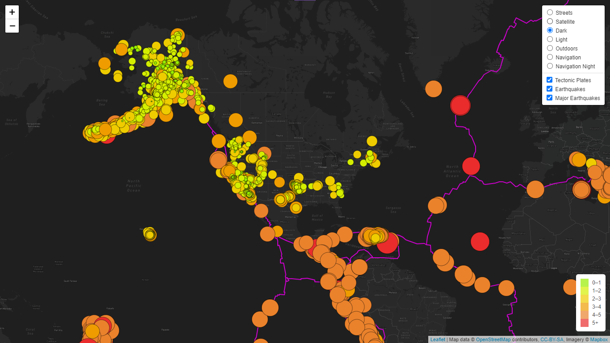

# Mapping Earthquakes

This project focused on the application of web designing and visualization software, such as HTML-CSS-JavaScript, Leaflet, and Mapbox, and how we leveraged their useful functions for performing in-depth data analytics and visualizations.

## Table of Contents

- [Overview of Project](#overview-of-project)
  - [Resources](#resources)
  - [Challenge Overview](#challenge-overview)
- [Web Designing, Customization, and Analysis Results](#web-designing-customization-and-analysis-results)
  - [Deliverable 1: Add Tectonic Plate Data](#deliverable-1-add-tectonic-plate-data)
  - [Deliverable 2: Add Major Earthquake Data](#deliverable-2-add-major-earthquake-data)
  - [Deliverable 3: Add an Additional Map](#deliverable-3-add-an-additional-map)
- [Summary](#summary)
  - [Future Work](#future-work)
- [References](#references)

## Overview of Project

This project and Module 14 assignment focused on cultivating knowledge and skills of web designing and data analysis through some rigorous exercises for further understanding the concepts of integrating HyperText Markup Language (HTML), Cascading Style Sheet (CSS), JavaScript (JS), Leaflet (open source JS library for mobile-friendly interactive maps), and Mapbox (open source mapping libraries and applications) programs for building a dynamic and interactive webpage with optimized content, functionality, usability, and user experience. We then applied our knowledge and core skills to our webpage, perform in-depth analysis for mapping earthquakes in relation to the Earth's tectonic plates, adding multiple overlay objects, and adding other map elements. We have also learned how to implement the GitHub flow that allows us collaborate on projects.

### Resources

- Source code: [challenge_logic.js](./Earthquake_Challenge/static/js/challenge_logic.js), [style.css](./Earthquake_Challenge/static/css/style.css), [index.html](./Earthquake_Challenge/index.html).
- Source data: [USGS Past 7 Days All Earthquakes](https://earthquake.usgs.gov/earthquakes/feed/v1.0/summary/all_week.geojson), [USGS Past 7 Days M4.5+ Earthquakes](https://earthquake.usgs.gov/earthquakes/feed/v1.0/summary/4.5_week.geojson), [GeoJSON/PB2002_boundaries.json](https://github.com/fraxen/tectonicplates/blob/master/GeoJSON/PB2002_boundaries.json).
- Image file: jpg/png files
- Software: [HTML: HyperText Markup Language](https://developer.mozilla.org/en-US/docs/Web/HTML), [CSS: Cascading Style Sheet](https://developer.mozilla.org/en-US/docs/Web/CSS), [JavaScript reference](https://developer.mozilla.org/en-US/docs/Web/JavaScript/Reference), [Leaflet](https://leafletjs.com/index.html), [Mapbox Styles API](https://docs.mapbox.com/api/maps/styles/), [Chrome DevTools](https://developer.chrome.com/docs/devtools/overview/), [Data-Driven Documents (D3)](https://d3js.org/), [GitHub](https://github.com/).

### Challenge Overview

Outline of our deliverables and a written report for presenting our results and analysis summary:

- ☑️ Deliverable 1: Add Tectonic Plate Data.
- ☑️ Deliverable 2: Add Major Earthquake Data.
- ☑️ Deliverable 3: Add an Additional Map.
- ☑️ A Summary on how to create the earthquake map with multiple layers and maps (this ["README.md"](./README.md)).

## Web Designing, Customization, and Analysis Results

By using several web designing tools, such as HTML, CSS, JavaScript, Leaflet, Mapbox Maps, and Chrome DevTools, we were able to design and integrate maps for visualizing earthquakes that lets users explore the earthquake databases from U.S. Geological Survey (USGS)). We have incorporated some best practices when designing a website, which include enhanced user-friendly overlay selections, various map backgrounds, and map legend, good usability and user experience.

### Customization and Optimization

The refactored JS code and screenshots of our webpage can be referred in [challenge_logic.js](./Earthquake_Challenge/static/js/challenge_logic.js) and Fig. 1&ndash;4. Some optimized settings, simplified variable definitions, and efficient functions that I used for mapping earthquakes efficiently are summarized below.

- common color settings and ternary operators for both legend and marker based on magnitude were used instead of setting them manually, which saved at least 10 lines of coding while maintaining our high quality deliverables, for instance:

  ```
  // Set common color settings for both legend and marker based on magnitude
  const colors = [
    '#98ee00',
    '#d4ee00',
    '#eecc00',
    '#ee9c00',
    '#ea822c',
    '#ea2c2c'
  ];
  ```

  ```
    // This function determines the color of the marker based on the magnitude of the M4.5+ earthquakes
    function getColor(magnitude) {
      idx = magnitude > 6 ? 5 : (Math.ceil(magnitude) - 2);
      return colors[idx];
    }
  ```

- retrieving [USGS Past 30 Days All Earthquakes](https://earthquake.usgs.gov/earthquakes/feed/v1.0/summary/all_month.geojson) and [USGS Past 30 Days M4.5+ Earthquakes](https://earthquake.usgs.gov/earthquakes/feed/v1.0/summary/4.5_month.geojson) would let better understanding of where most earthquakes occur. The data let us observe a clear relationship between the locations of earthquakes, especially those M4.5+ earthquakes, and the Earth's tectonic plates.
- all background maps were selectable in addition to `Streets`, `Satellite Streets`, or `Dark`.

Fig. 1 outlines the design and layout of our webpage, which includes selectable layers, overlays, and a static legend with color scales representing the magnitude scales.

  
**Fig. 1 Mapping Earthquake webpage.**

### Deliverable 1: Add Tectonic Plate Data

Several map layers and two overlays (`Tectonic Plates` and `Earthquakes`) were added to the streets background map as illustrated in Fig. 2.

  
**Fig. 2 Mapping all earthquakes with selectable layers and overlays on the `Streets` background.**

### Deliverable 2: Add Major Earthquake Data

Several map layers and two overlays (`Tectonic Plates`, `Earthquakes`, and `Major Earthquakes`) were added to the streets background map as illustrated in Fig. 3.

  
**Fig. 3 Mapping major earthquakes with selectable layers and overlays on the `Streets` background.**

### Deliverable 3: Add an Additional Map

Several map layers and two overlays (`Tectonic Plates`, `Earthquakes`, and `Major Earthquakes`) were added to the dark background map as illustrated in Fig. 4.

  
**Fig. 4 Mapping all earthquakes with selectable layers and overlays on the `Dark` background.**

## Summary

All deliverables have been designed and developed according to the assignment requirements, including well optimized functionality, better usability, validation of some additional features, and effective code refactoring. Using [USGS Past 30 Days M4.5+ Earthquakes](https://earthquake.usgs.gov/earthquakes/feed/v1.0/summary/4.5_month.geojson) would let us better understand where most earthquakes occur. The overlay map in Fig. 3 reconfirms that most major earthquakes, especially those M4.5+ earthquakes, occur along the tectonic plates or the fault lines where tectonic plates meet, which had been scientifically reported in other studies (e.g. [USGS FAQs](https://www.usgs.gov/faqs/where-do-earthquakes-occur)).

### Future Work

All earthquakes and all major M4.5+ earthquakes occurring in the past 7-days can also be added in addition to `Tectonic Plates`, `Earthquakes`, and `Major Earthquakes` overlays. `Earthquakes Past 7-Days` and `M4.5+ Past 7-Days` overlays are currently disabled by default unless users enable them after loading the webpage. Fig. 5 shows when both `Tectonic Plates` and `M4.5+ Past 7-Days` overlays were selected and displayed on the streets background map. The map accurately captured the heartbreaking earthquake that recently struck Turkey.

  
**Fig. 5 Mapping major earthquakes that were recorded in the past 7 days and displayed on the `Streets` background.**

## References

[HTML: HyperText Markup Language](https://developer.mozilla.org/en-US/docs/Web/HTML)  
[CSS: Cascading Style Sheet](https://developer.mozilla.org/en-US/docs/Web/CSS)  
[JavaScript reference](https://developer.mozilla.org/en-US/docs/Web/JavaScript/Reference)  
[Leaflet](https://leafletjs.com/index.html)  
[Mapbox Styles API](https://docs.mapbox.com/api/maps/styles/)  
[Chrome DevTools](https://developer.chrome.com/docs/devtools/overview/)  
[Data-Driven Documents (D3)](https://d3js.org/)  
[HTML HEX Colors](https://www.w3schools.com/html/html_colors_hex.asp)  
[GitHub Docs - GitHub flow](https://docs.github.com/en/get-started/quickstart/github-flow)  
