# Mapping Earthquakes

This project focused on the application of web designing and visualization software, such as HTML-CSS-JavaScript, Leaflet, and Mapbox, and how we leveraged their useful functions for performing in-depth data analytics and visualizations.

## Table of Contents

- [Overview of Project](#overview-of-project)
  - [Resources](#resources)
  - [Challenge Overview](#challenge-overview)
- [Web Designing, Customization, and Analysis Results](#web-designing-customization-and-analysis-results)
  - [Deliverable 1: Add Tectonic Plate Data](#deliverable-1-add-tectonic-plate-data)
  - [Deliverable 2: Add Major Earthquake Data](#deliverable-2-add-major-earthquake-data)
  - [Deliverable 3: Add an Additional Map](#deliverable-3-add-an-additional-map)
- [Summary](#summary)
- [Future Work](#future-work)
  - [2023 Southern Turkey Earthquake](#2023-southern-turkey-earthquake)
  - [2023 Western Morocco Earthquake](#2023-western-morocco-earthquake)
  - [2024 Eastern Taiwan Earthquake](#2024-eastern-taiwan-earthquake)
  - [2025 Burma (Myanmar) Earthquake](#2025-burma-myanmar-earthquake)
- [References](#references)

## Overview of Project

This project and Module 14 assignment focused on cultivating knowledge and skills of web designing and data analysis through some rigorous exercises for further understanding the concepts of integrating HyperText Markup Language (HTML), Cascading Style Sheet (CSS), JavaScript (JS), Leaflet (open source JS library for mobile-friendly interactive maps), and Mapbox (open source mapping libraries and applications) programs for building a dynamic and interactive webpage with optimized content, functionality, usability, and user experience. We then applied our knowledge and core skills to our webpage, perform in-depth analysis for mapping earthquakes in relation to the Earth's tectonic plates, adding multiple overlay objects, and adding other map elements. We have also learned how to implement the GitHub flow that allows us to collaborate on projects.

### Resources

- Source code: [challenge_logic.js](./Earthquake_Challenge/static/js/challenge_logic.js), [style.css](./Earthquake_Challenge/static/css/style.css), [index.html](./Earthquake_Challenge/index.html).
- Source data: [USGS Past 7 Days All Earthquakes](https://earthquake.usgs.gov/earthquakes/feed/v1.0/summary/all_week.geojson), [USGS Past 7 Days M4.5+ Earthquakes](https://earthquake.usgs.gov/earthquakes/feed/v1.0/summary/4.5_week.geojson), [GeoJSON/PB2002_boundaries.json](https://github.com/fraxen/tectonicplates/blob/master/GeoJSON/PB2002_boundaries.json).
- Image file: jpg/png files
- Software: [HTML: HyperText Markup Language](https://developer.mozilla.org/en-US/docs/Web/HTML), [CSS: Cascading Style Sheet](https://developer.mozilla.org/en-US/docs/Web/CSS), [JavaScript reference](https://developer.mozilla.org/en-US/docs/Web/JavaScript/Reference), [Leaflet](https://leafletjs.com/index.html), [Mapbox Styles API](https://docs.mapbox.com/api/maps/styles/), [Chrome DevTools](https://developer.chrome.com/docs/devtools/overview/), [Data-Driven Documents (D3)](https://d3js.org/), [GitHub](https://github.com/).

### Challenge Overview

Outline of our deliverables and a written report for presenting our results and analysis summary:

- ☑️ Deliverable 1: Add Tectonic Plate Data.
- ☑️ Deliverable 2: Add Major Earthquake Data.
- ☑️ Deliverable 3: Add an Additional Map.
- ☑️ A Summary on how to create the earthquake map with multiple layers and maps (this ["README.md"](./README.md)).

## Web Designing, Customization, and Analysis Results

By using several web designing tools, such as HTML, CSS, JavaScript, Leaflet, Mapbox Maps, and Chrome DevTools, we were able to design and integrate maps for visualizing earthquakes that lets users explore the earthquake databases from U.S. Geological Survey (USGS)). We have incorporated some best practices when designing a website, which include enhanced user-friendly overlay selections, various map backgrounds, and map legend, good usability, and user experience.

### Customization and Optimization

The refactored JS code and screenshots of our webpage can be referred in [challenge_logic.js](./Earthquake_Challenge/static/js/challenge_logic.js) and Figs. 1&ndash;4. Some optimized settings, simplified variable definitions, and efficient functions that I used for mapping earthquakes efficiently are summarized below.

- common color settings and ternary operators for both legend and marker based on magnitude were used instead of setting them manually, which saved at least 10 lines of coding while maintaining our high quality deliverables, for instance:

  ```
  // Set common color settings for both legend and marker based on magnitude
  const colors = [
    '#98ee00',
    '#d4ee00',
    '#eecc00',
    '#ee9c00',
    '#ea822c',
    '#ea2c2c'
  ];
  ```

  ```
    // This function determines the color of the marker based on the magnitude of the M4.5+ earthquakes
    function getColor(magnitude) {
      idx = magnitude > 6 ? 5 : (Math.ceil(magnitude) - 2);
      return colors[idx];
    }
  ```

- retrieving [USGS Past 30 Days All Earthquakes](https://earthquake.usgs.gov/earthquakes/feed/v1.0/summary/all_month.geojson) and [USGS Past 30 Days M4.5+ Earthquakes](https://earthquake.usgs.gov/earthquakes/feed/v1.0/summary/4.5_month.geojson) would let better understanding of where most earthquakes occur. The data let us observe a clear relationship between the locations of earthquakes, especially those M4.5+ earthquakes, and the Earth's tectonic plates.
- all background maps were selectable in addition to `Streets`, `Satellite Streets`, or `Dark`.

Fig. 1 outlines the design and layout of our webpage, which includes selectable layers, overlays, and a static legend with color scales representing the magnitude scales.

  
**Fig. 1 Mapping Earthquake webpage.**

### Deliverable 1: Add Tectonic Plate Data

Several map layers and two overlays (`Tectonic Plates` and `Earthquakes`) were added to the streets background map as illustrated in Fig. 2.

  
**Fig. 2 Mapping all earthquakes with selectable layers and overlays on the `Streets` background.**

### Deliverable 2: Add Major Earthquake Data

Several map layers and two overlays (`Tectonic Plates`, `Earthquakes`, and `Major Earthquakes`) were added to the streets background map as illustrated in Fig. 3.

  
**Fig. 3 Mapping major earthquakes with selectable layers and overlays on the `Streets` background.**

### Deliverable 3: Add an Additional Map

Several map layers and two overlays (`Tectonic Plates`, `Earthquakes`, and `Major Earthquakes`) were added to the dark background map as illustrated in Fig. 4.

  
**Fig. 4 Mapping all earthquakes with selectable layers and overlays on the `Dark` background.**

## Summary

All deliverables have been designed and developed according to the assignment requirements, including well optimized functionality, better usability, validation of some additional features, and effective code refactoring. Using [USGS Past 30 Days M4.5+ Earthquakes](https://earthquake.usgs.gov/earthquakes/feed/v1.0/summary/4.5_month.geojson) would let us better understand where most earthquakes occur. The overlay map in Fig. 3 reconfirms that most major earthquakes, especially those M4.5+ earthquakes, occur along the tectonic plates or the fault lines where tectonic plates meet, which had been scientifically reported in other studies (e.g. [USGS FAQs](https://www.usgs.gov/faqs/where-do-earthquakes-occur)).

## Future Work

All earthquakes and all major M4.5+ earthquakes occurring in the past 7-days can also be added in addition to `Tectonic Plates`, `Earthquakes`, and `Major Earthquakes` overlays. `Earthquakes Past 7-Days` and `M4.5+ Past 7-Days` overlays are currently disabled by default unless users enable them after loading the webpage.

### 2023 Southern Turkey Earthquake

On February 6, 2023 (UTC) a major M7.8 earthquake was recorded around the southern part of Turkey. The epicenter of the quake was about 26 km east of Nurdağı, Turkey, and the powerful and shallow quake severely devastated the southern areas of Turkey and the northwestern part of Syria. More detailed information about the M7.8 earthquake that struck the southern areas of Turkey in early February 2023 can be found in [USGS.gov featured story about the powerful Turkey earthquake](https://www.usgs.gov/news/featured-story/m78-and-m75-kahramanmaras-earthquake-sequence-near-nurdagi-turkey-turkiye).

- Magnitude at the epicenter: **M7.8**
- Location: about 26 km east of Nurdağı, **Turkey**
- Depth of the epicenter: about **17.925 km**
- Date/Time: February 6, 2023, around 01:17:35 UTC
- Casualties: more than 60000 killed and 121000 injured/missing (source: [Wikipedia](https://en.wikipedia.org/wiki/2023_Turkey%E2%80%93Syria_earthquakes))

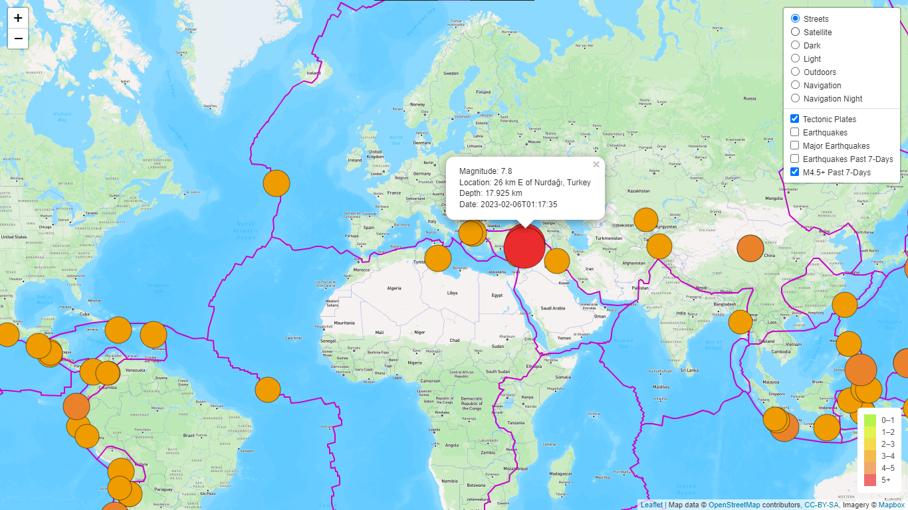  
**Fig. 5 Mapping major earthquakes that were recorded in the past 7 days after Feb 6, 2023 and displayed on the `Streets` background.**

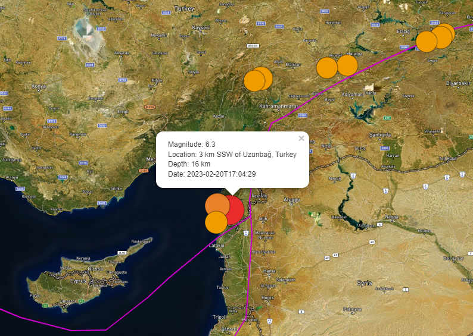  
**Fig. 6 Mapping major aftershocks following the major earthquake on Feb 6, 2023 and displayed on the `Satellite-Streets` background.**

Figs. 5&ndash;6 illustrate the recorded strong earthquakes when both `Tectonic Plates` and `M4.5+ Past 7-Days` overlays were selected and displayed on a specified background map.

- Fig. 5 shows the devastating earthquake of M7.8 that struck Turkey on February 6, 2023 at around 01:17:35 UTC.
- Fig. 6 shows multiple powerful aftershocks, including a M6.3 aftershock that subsequently struck the southern Turkey areas on February 20, 2023 at 17:04:29 UTC.

### 2023 Western Morocco Earthquake

On September 8, 2023 (UTC) another devastating M6.8 earthquake was recorded around the western part of Morocco. The epicenter of the quake was about 18 km west/southwest of Oukaïmedene, Morocco. Although the magnitude scale of this M6.8 quake was not as bad as that of the southern Turkey earthquake, the strong and shallow quake again caused severe damage and death toll throughout the southwest region of Morocco. More detailed information about the M6.8 earthquake that hit the western/southwestern region of Morocco in early September 2023 can also be found in [USGS.gov featured story about the strong Morocco earthquake](https://www.usgs.gov/news/featured-story/major-earthquake-strikes-oukaimedene-morocco).

- Magnitude at the epicenter: **M6.8**
- Location: about 54 km west/southwest of Oukaïmedene, **Morocco** (southwest of Marrakesh/Marrakech)
- Depth of the epicenter: **about 18 km**
- Date/Time: September 8, 2023, around 22:11:01 UTC
- Casualties: more than 2900 killed and 5600 injured (source: [Brittanica](https://www.britannica.com/event/Morocco-earthquake-of-2023))

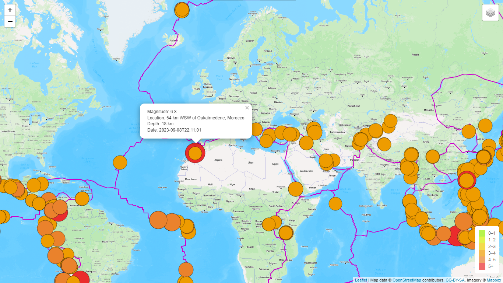  
**Fig. 7 Mapping major earthquakes that were recorded in the past 7 days after Sep 8, 2023 and displayed on the `Streets` background.**

<hr>
<table><tr><td>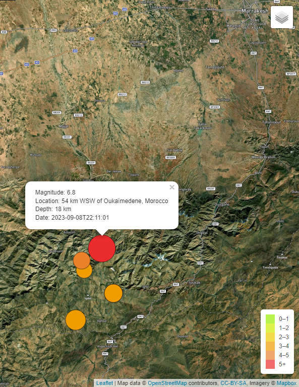</td><td>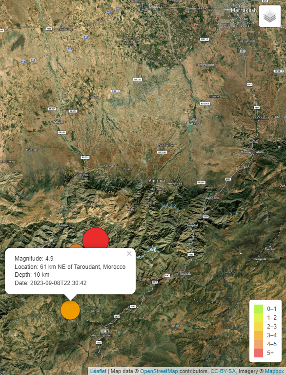</td><td>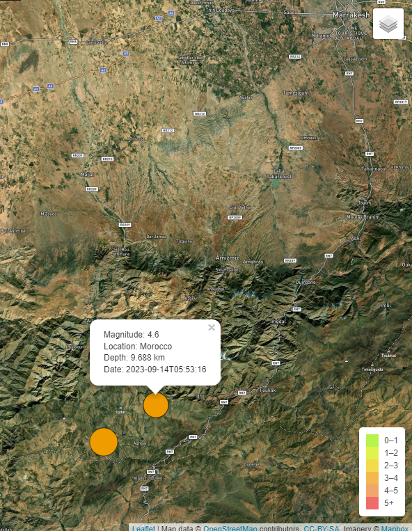</td></tr></table>

**Fig. 8 From left to right: (a) Epicenter of the major M6.8 earthquake that struck the western part of Morocco, (b&ndash;c) Mapping major aftershocks of magnitude scale &gt; M4.5 that were recorded in the past 7 days on Sep 8-14, 2023 and displayed on the `Satellite-Streets` background.**
<hr>

Figs. 7&ndash;8 illustrate the recorded strong earthquakes when `Tectonic Plates`, `Major Earthquakes`, `M4.5+ Past 7-Days` and `Earthquakes Past 7-Days` overlays were selected and displayed on a specified background map.

- Fig. 7 shows the shallow and devastating earthquake of M6.8 that struck Morocco on September 8, 2023 at around 22:11:01 UTC.
- Fig. 8 shows several aftershocks of magnitude scale &gt; M4.5 that subsequently rocked western/southwestern Morocco on September 8, 2023 at 22:30:42 UTC and September 14, 2023 at 05:53:16 UTC.

### 2024 Eastern Taiwan Earthquake

On April 3, 2024 (UTC) a devastating M7.4 earthquake was recorded around the eastern coastal area of Taiwan. The epicenter of the quake was about 18 km south/southwest of Hualien City (花蓮市), Taiwan. More detailed information about the M7.4 earthquake that hit the eastern Taiwan in early April 2024 can also be found in [USGS.gov featured story about the eastern Taiwan earthquake](https://www.usgs.gov/news/featured-story/strong-quake-and-aftershocks-rattle-eastern-taiwan).

- Magnitude at the epicenter: **M7.4**
- Location: about 18 km south/southwest of Hualien City (花蓮市), **Taiwan** (east coast of Taiwan facing the Pacific Ocean)
- Depth of the epicenter: **about 34.75 km**
- Date/Time: April 3, 2024, around 23:58:11 UTC
- Casualties: more than 19 killed and 1100 injured (source: [Wikipedia](https://en.wikipedia.org/wiki/2024_Hualien_earthquake))

<hr>
<table><tr><td>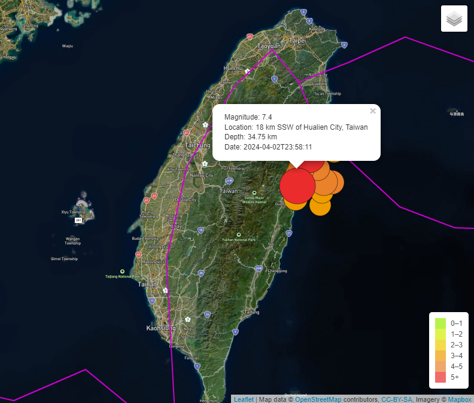</td><td>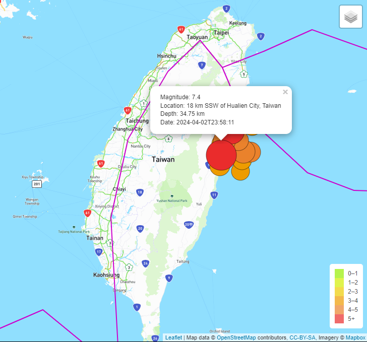</td></tr></table>

**Fig. 8 From left to right: (a) Epicenter of the major M7.4 earthquake that struck the eastern coastal area of Taiwan near Hualien City, (b) Mapping major earthquakes of magnitude scale &gt; M4.5 that were recorded in the past 7 days after Apr 3, 2024 near the epicenter and displayed on the `Navigation` background.**
<hr>

Fig. 8 illustrates the recorded strong earthquake of M7.4 and multiple aftershocks when `Tectonic Plates` and `Major Earthquakes` or `M4.5+ Past 7-Days` overlays were selected and displayed on a specified background map.

### 2025 Burma (Myanmar) Earthquake

On March 28, 2025 (UTC) devastating M7.7 earthquake and M6.7 aftershock were recorded near Myanmar's 2<sup>nd</sup> largest city, Mandalay. The epicenter of the powerful quake was about 16 km west of Mandalay City, Myanmar. More detailed information about the M7.7 earthquake that struck Myanmar on March 28, 2025 can also be found in [USGS.gov M 7.7 - 2025 Mandalay, Burma (Myanmar) Earthquake](https://earthquake.usgs.gov/earthquakes/eventpage/us7000pn9s/executive).

- Magnitude at the epicenter: **M7.7**
- Location: about 16 km west of Mandalay, **Burma (Myanmar)**
- Depth of the epicenter: **about 10 km**
- Date/Time: March 28, 2025, around 06:20:52 UTC

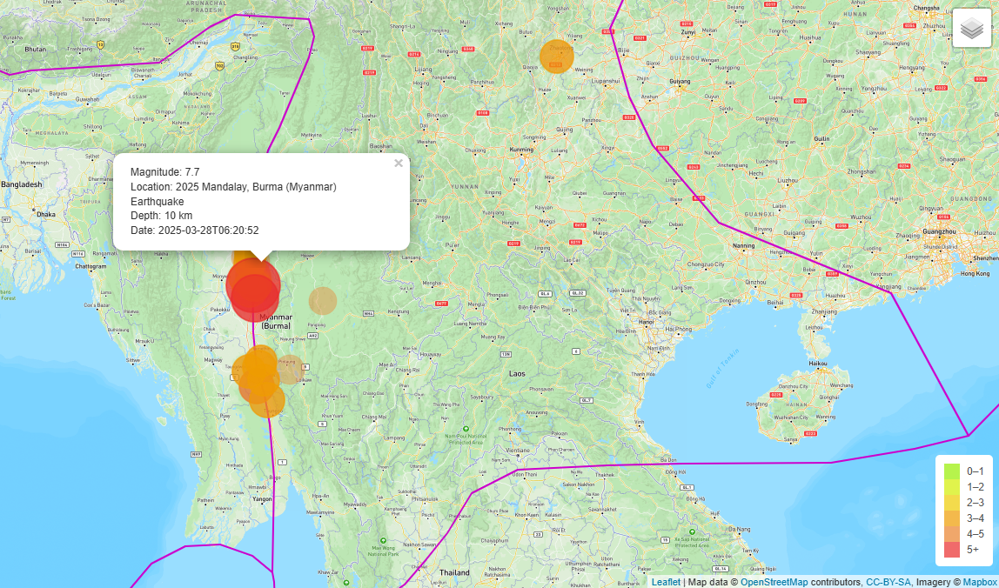  
**Fig. 9 Mapping major earthquakes that were recorded in the past 7 days after Mar 28, 2025 and displayed on the `Streets` background.**

<hr>
<table><tr><td>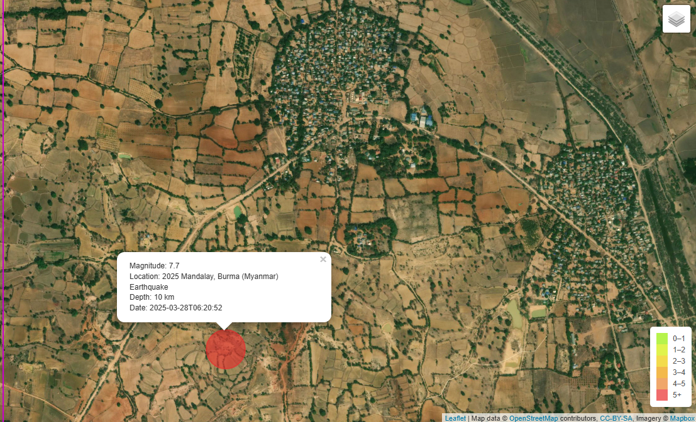</td><td>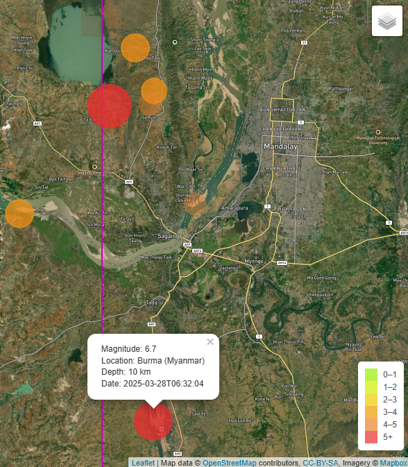</td></tr></table>

**Fig. 10 From left to right: (a) Epicenter of the devastating M7.7 earthquake that struck Myanmar near Mandalay City, (b) Mapping major earthquakes of magnitude scale &gt; M4.5 that were recorded in the past 7 days near the epicenter and displayed on the `Satellite-Streets` background.**
<hr>

Figs. 9&ndash;10 illustrate the powerful earthquakes when `Tectonic Plates`, `Major Earthquakes`, `M4.5+ Past 7-Days` or `Earthquakes Past 7-Days` overlays were selected and displayed on a specified background map.

- Fig. 9 shows the shallow and devastating earthquake of M7.7 that struck Myanmar on March 28, 2025 at around 06:20:52 UTC.
- Fig. 10 shows several aftershocks of magnitude scale &gt; M4.5, including a strong M6.7 aftershock that subsequently rocked about 11 minutes following the M7.7 quake the damaged areas near Mandalay City, Myanmar on March 28, 2025. 

## References

[HTML: HyperText Markup Language](https://developer.mozilla.org/en-US/docs/Web/HTML)  
[CSS: Cascading Style Sheet](https://developer.mozilla.org/en-US/docs/Web/CSS)  
[JavaScript reference](https://developer.mozilla.org/en-US/docs/Web/JavaScript/Reference)  
[Leaflet](https://leafletjs.com/index.html)  
[Mapbox Styles API](https://docs.mapbox.com/api/maps/styles/)  
[Chrome DevTools](https://developer.chrome.com/docs/devtools/overview/)  
[Data-Driven Documents (D3)](https://d3js.org/)  
[HTML HEX Colors](https://www.w3schools.com/html/html_colors_hex.asp)  
[GitHub Docs - GitHub flow](https://docs.github.com/en/get-started/quickstart/github-flow)  
[USGS FAQs](https://www.usgs.gov/faqs/where-do-earthquakes-occur)  
[USGS.gov featured story about Turkey earthquake](https://www.usgs.gov/news/featured-story/m78-and-m75-kahramanmaras-earthquake-sequence-near-nurdagi-turkey-turkiye)  
[USGS.gov featured story about Morocco earthquake](https://www.usgs.gov/news/featured-story/major-earthquake-strikes-oukaimedene-morocco)  
[USGS.gov featured story about the eastern Taiwan earthquake](https://www.usgs.gov/news/featured-story/strong-quake-and-aftershocks-rattle-eastern-taiwan)  
[USGS.gov M 7.7 - 2025 Mandalay, Burma (Myanmar) Earthquake](https://earthquake.usgs.gov/earthquakes/eventpage/us7000pn9s/executive)  
 